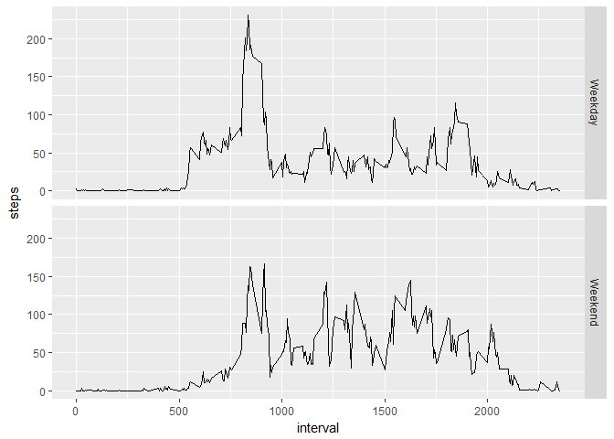

# Reproducible Research: Peer Assessment 1


## Loading and preprocessing the data
###Load packages
Two packages were used to create the analysis and are loaded a the beginning

```r
library(dplyr)
```

```
## 
## Attaching package: 'dplyr'
```

```
## The following objects are masked from 'package:stats':
## 
##     filter, lag
```

```
## The following objects are masked from 'package:base':
## 
##     intersect, setdiff, setequal, union
```

```r
library(ggplot2)
```

```
## Warning: package 'ggplot2' was built under R version 3.3.2
```

###1. Code for reading in the dataset and/or processing the data

The data was provided via a zip file. The next code chunk downloads the zip files then reads the data from it into R.


```r
temp<- tempfile()
download.file("https://d396qusza40orc.cloudfront.net/repdata%2Fdata%2Factivity.zip", temp)
activity_data <- read.csv(unz(temp, "activity.csv"))
```

###2. Histogram of the total number of steps taken each day
To build the histogram the first step is to process the data into the format where the data provides the total steps per day. At that point the histogram is created, where it is seen that the the most common frequency of steps the subject takes is between 10,000 and 15,000 per day.


```r
date_totals <- aggregate(steps ~ date, data = activity_data,FUN = "sum")
date_totals$date <- as.Date(date_totals$date, "%Y-%m-%d")
hist(date_totals$steps)
```

<!-- -->


## What is mean total number of steps taken per day?
###3. Mean and median number of steps taken each day
The simplest way to how the mean and median steps per day is to use the summary function on the steps variable created in the aggregated data set created for the histrogram. 

```r
summ <- summary(date_totals$steps)
print(summ[4])
```

```
##  Mean 
## 10770
```

```r
print(summ[3])
```

```
## Median 
##  10760
```

## What is the average daily activity pattern?
###4. Time series plot of the average number of steps taken
Another aggregration of the data is required to show a time series against interval. To clarify the interval format, "5" is equal to "00:05", "325" is equal to "03:25" and "2130" is equal to "21:30"".


```r
#calculate the average steps per interval
interval_averages <- aggregate(steps ~ interval, data = activity_data,FUN = "mean")

#time seres plot of average steps per 5 minutes
ggplot(interval_averages, aes(interval, steps))+
    geom_line(stat = "identity")
```

<!-- -->

###5.The 5-minute interval that, on average, contains the maximum number of steps

```r
print(interval_averages[interval_averages$steps == max(interval_averages$steps),])
```

```
##     interval    steps
## 104      835 206.1698
```
As per questions point of format, we can see that "835" is the interval with the highest average of steps over the two months. Therefore, the subject is on average most active in terms of steps at 08:35 in the morning.


## Imputing missing values

###6. Code to describe and show a strategy for imputing missing data
The first step taken below is to calculate how many rows are missing step data. Next, as per the Project's advice, the strategy to impute was kept simple and the average for each time interval was used. As the average for each time interval had already been calculated in question 4 this was used to fill in the missing data.

The method for doing so was using the "dplyr" package, where the original data set was joined with the aggreated time intervals. If any steps were missing in the original data set then the average was used, otherwise the original steps were used. This created the new dataset, activity_data2. The check for count of NAs is then made again to ensure no NAs are included in the data.

```r
#number of rows with na data in dataset
print(nrow(activity_data[is.na(activity_data) == TRUE,]))
```

```
## [1] 2304
```

```r
#Fix the missing values by substituting in the average over the two months for that same interval
activity_data2 <- activity_data%>%
    left_join(interval_averages, by = "interval")%>%
    mutate(steps = ifelse(is.na(steps.x), steps.y, steps.x))%>%
    select(-c(steps.x, steps.y))

print(nrow(activity_data2[is.na(activity_data2) == TRUE,]))
```

```
## [1] 0
```
###7.1 Histogram of the total number of steps taken each day after missing values are imputed
The 7th question has been split in two. The first part is to show the creation of the aggregated dat, and to show the original and new histograms together

```r
##Do the same analysis but with missing values replaced
date_totals2 <- aggregate(steps ~ date, data = activity_data2,FUN = "sum")
date_totals2$date <- as.Date(date_totals2$date, "%Y-%m-%d")

#show histrogram of total steps per day
hist(date_totals$steps, main = "Original Histogram of Steps per day")
```

<!-- -->

```r
hist(date_totals2$steps, main = "New Histogram of Steps per day")
```

<!-- -->
###7.2 Mean and Median
Report the mean and median total number of steps taken per day. Do these values differ from the estimates from the first part of the assignment? What is the impact of imputing missing data on the estimates of the total daily number of steps?


```r
#mean steps per day
newmean <- mean(date_totals2$steps)
#median steps per day
newmedian <- median(date_totals2$steps)

print("Means")
```

```
## [1] "Means"
```

```r
print(newmean)
```

```
## [1] 10766.19
```

```r
print(summ[4])
```

```
##  Mean 
## 10770
```

```r
print("Medians")
```

```
## [1] "Medians"
```

```r
print(newmedian)
```

```
## [1] 10766.19
```

```r
print(summ[3])
```

```
## Median 
##  10760
```

The new mean is 1.0766189\times 10^{4} while the original mean 1.077\times 10^{4}. For the median, the new is 1.0766189\times 10^{4} and the original is 'r summ[3]`. Both sets are very similar to each other, so we can say filling in the missing values has not caused a large variation in the results.

## Are there differences in activity patterns between weekdays and weekends?
###8.1 Create a new factor variable in the dataset with two levels - "weekday" and "weekend" indicating whether a given date is a weekday or weekend day.

The below chunk takes the data in the dataset, calculates the day of the week if was, and then does an if else function to decide if that day was the weekend or not. It then aggregates by this new level along with interval so we can see average steps per interbal by weekday or weekend.

```r
activity_data2 <- activity_data2 %>%
    mutate(weekdayFlag = ifelse(weekdays(as.Date(date, "%Y-%m-%d")) %in% c("Saturday","Sunday"),
                                         "Weekend", 
                                         "Weekday"))

wd_data <- aggregate(steps ~ interval + weekdayFlag, data = activity_data2, FUN = "mean")
```


###8.2 Panel plot comparing the average number of steps taken per 5-minute interval across weekdays and weekends
The last step is to show plots comparing weekend and weekdays. The main difference visible is that during the weekdays there is a noticibable spike in the morning, with the remainder of the day at a much lower pace. The weekend does not have such a dominating peak in the morning, but the remainder of the day is generally more active than the weekdays.

```r
ggplot(wd_data, aes(interval, steps))+
    geom_line(stat = "identity")+
    facet_grid(weekdayFlag~.)
```

<!-- -->
